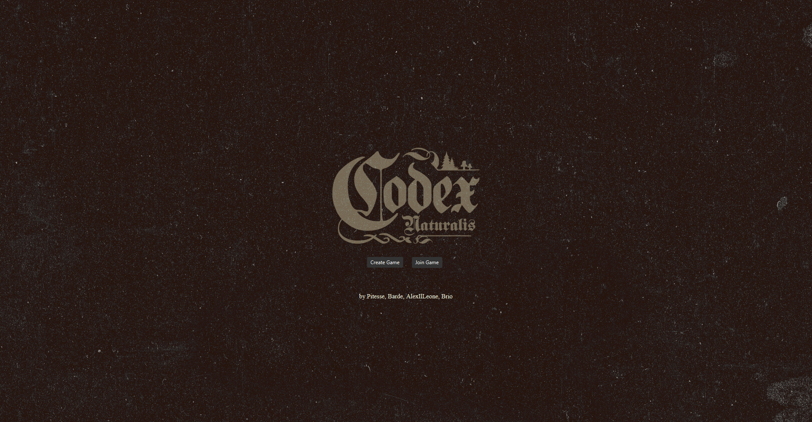
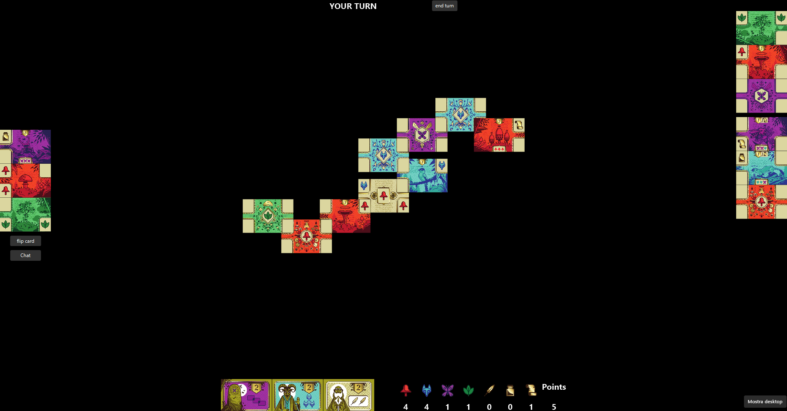
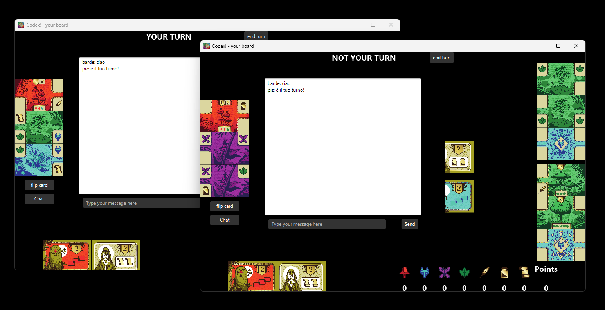

# Codex Naturalis - board game


## Built by
- Lorenzo Bardelli 10831941 `lorenzo1.bardelli@mail.polimi.it` 
- Pietro Pizzoccheri 10797420 `pietro.pizzoccheri@mail.polimi.it` 
- Alex Hathaway 10829946 `alex.hathaway@mail.polimi.it` 
- Mattia Brianti 10773859 `mattia.brianti@mail.polimi.it` 

## Functionalities
|     Feature      | state |
|:----------------:|:-----:|
| complete ruleset |   ✅   |
| socket handling  |   ✅   |
|  GUI interface   |   ✅   |
|  CLI interface   |   ✅   |
|   in-game chat   |   ✅   |

[documentation](https://github.com/omgbarde/IS24-LB04/tree/master/deliverables)

## Requirements
- A working LAN connection is required to play with multiple pc.
- to build and run: OpenJDK 21
- to test: Junit 4.13.1

## Getting started
in command line navigate to the deliverables folder and run the following commands:
1. first launch the serverApp and choose the default port when asked in the command line\
   to start Server:
    ```sh
    java -jar CodexBoardGame.jar --ser
    ```
2. then launch the clients in the desired mode (omit arguments to play in default mode GUI)\
    to start CLI:
   
    ```sh
    java -jar CodexBoardGame.jar --cli
    ```
    
    to start GUI:
  
    ```sh
    java -jar CodexBoardGame.jar --gui
    ```
   
3. lastly create or join a game
  - to create a game use the port displayed by the serverApp in the console.
  - to join a game use the correct ip address and port of the person hosting the game (the network interfaces are also displayed in the console by the serverApp)

## How to play
- [codex rulebook](src/main/resources/CODEX_Rulebook_IT.pdf)
- the controls are displayed in the view based on the graphic mode

## Demos




